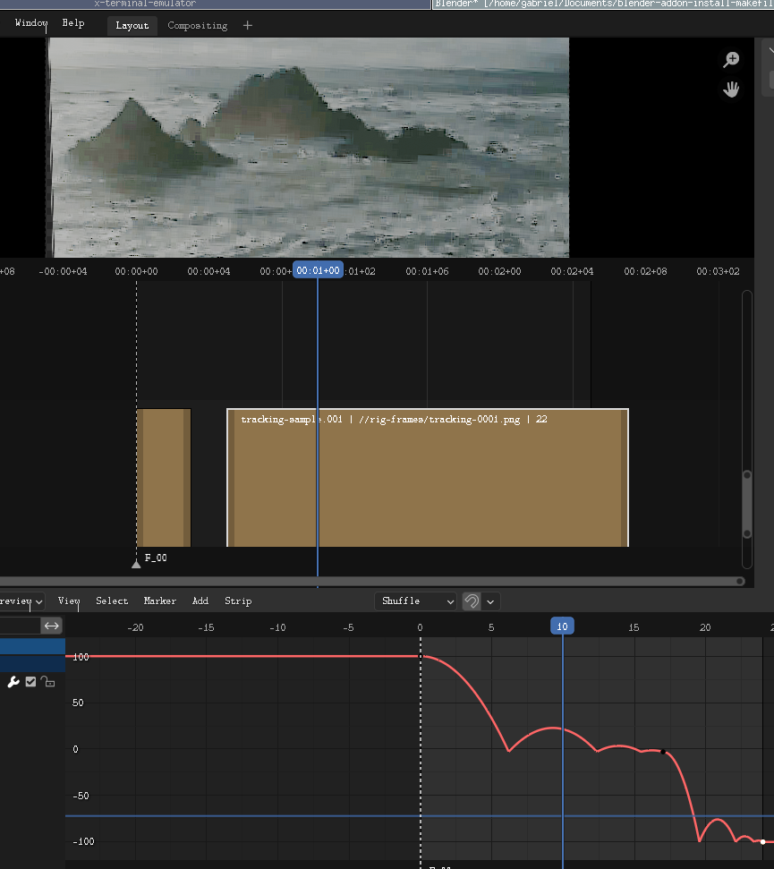
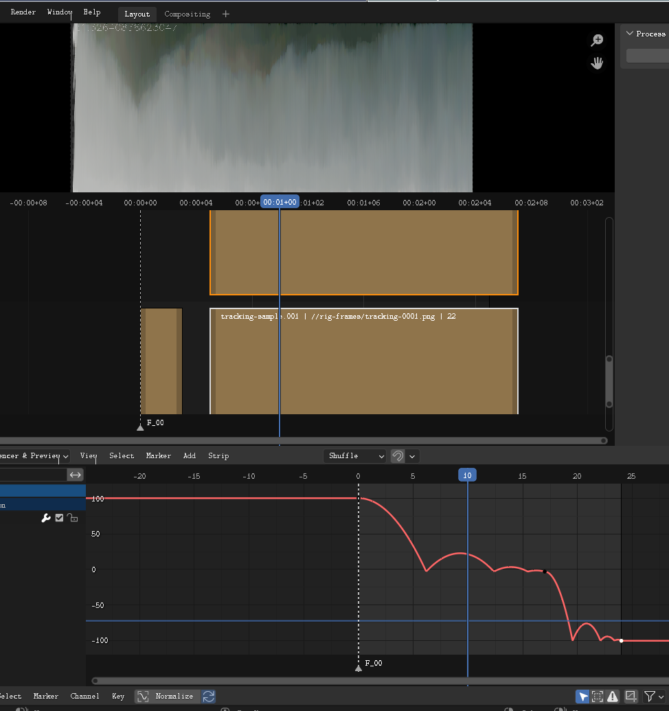

= process_vse_sort
Gabriel Montagné Láscaris-Comneno <gabriel@tibas.london>
v0.0.1

"Sort Pixels" simple reference implementation of a server for https://github.com/gabrielmontagne/blender-addon-process-vse-strip using https://github.com/gabrielmontagne/xyy. 

This server takes the images from the strip and sorts their pixes vertically.

